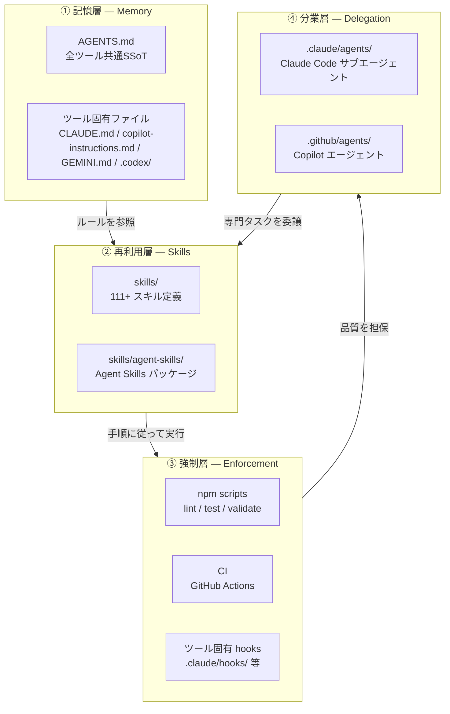

# エージェント運用の4層アーキテクチャ

> **対象読者:** このリポジトリで AI コーディングエージェントを使う開発者・管理者

## なぜ層を分けるのか

AI コーディングエージェントを「賢いチャット相手」として使い続ける限り、返ってくるのは毎回ゼロから組み立てたチャットの返答です。
再現性のある開発システムにするには、**記憶の置き場、手順の置き場、強制の置き場、分業の置き場**を分ける必要があります。

本リポジトリでは以下の4層でエージェントの動作を制御しています。

---

## 4層の定義

### ① 記憶層（Memory）

**役割:** プロジェクトの常設メモリ。毎セッション新しいコンテキストで始まるエージェントに、継続して効かせたいルール・構成・禁止事項を伝える。

| ファイル                          | スコープ                   | ツール非依存 |
| --------------------------------- | -------------------------- | ------------ |
| `AGENTS.md`                       | 全エージェント共通（SSoT） | ◯            |
| `CLAUDE.md`                       | Claude Code 差分           | ✕            |
| `.github/copilot-instructions.md` | Copilot 差分               | ✕            |
| `GEMINI.md`                       | Gemini 差分                | ✕            |
| `.codex/`                         | Codex 差分                 | ✕            |

**設計原則:** `AGENTS.md` がすべてのルールの Single Source of Truth。ツール固有ファイルは薄い差分のみ。

### ② 再利用層（Skills）

**役割:** チーム固有の暗黙知を再利用可能なレビュー資産として明示化する。毎回ゼロから説明する代わりに、「この作業はこの手順でやれ」を外出しする層。

| ディレクトリ           | 内容                       | 形式                        |
| ---------------------- | -------------------------- | --------------------------- |
| `skills/upstream/`     | 設計・アーキテクチャスキル | YAML frontmatter + Markdown |
| `skills/midstream/`    | 実装・コード品質スキル     | 同上                        |
| `skills/downstream/`   | テスト・QA スキル          | 同上                        |
| `skills/agent-skills/` | Agent Skills パッケージ    | SKILL.md + references/      |

**設計原則:** スキルはツール非依存。JSON Schema で検証可能（`npm run skills:validate`）。

### ③ 強制層（Enforcement）

**役割:** 決定論的なガードレール。「モデルの気分でやる」のではなく「必ず発火する」チェックを実現する。

| 強制ポイント   | 全ツール共通              | Claude Code              | Copilot              |
| -------------- | ------------------------- | ------------------------ | -------------------- |
| フォーマット   | `npm run format`          | PostToolUse hook（自動） | VS Code 保存時       |
| Lint           | `npm run lint`            | `/check` コマンド        | `/review` プロンプト |
| テスト         | `npm test`                | `/check` コマンド        | CI                   |
| スキル検証     | `npm run skills:validate` | CI                       | CI                   |
| リンクチェック | `npm run check:links`     | CI                       | CI                   |

**設計原則:**

- **npm scripts** が最大公約数（全ツールから実行可能）
- **CI（GitHub Actions）** が最終防衛線
- **ツール固有 hooks** は追加の自動化レイヤー（Claude Code の PostToolUse 等）
- 共通スクリプトは `hooks/` に配置し、ツール固有設定からはラッパーとして呼び出す

### ④ 分業層（Delegation）

**役割:** 専門サブエージェントに分解して並行処理する層。大きい仕事を1本の長いチャットに全部流し込むより、役割分担した方が安定する。

| エージェント   | Claude Code       | Copilot           | 役割                       |
| -------------- | ----------------- | ----------------- | -------------------------- |
| river-reviewer | `.claude/agents/` | `.github/agents/` | コードレビュー・リファクタ |
| architect      |—                | `.github/agents/` | アーキテクチャ設計         |
| security       |—                | `.github/agents/` | セキュリティレビュー       |
| qa             |—                | `.github/agents/` | QA・テスト                 |

**設計原則:** 各ツールの frontmatter 形式が異なるため、エージェント定義はツール別に維持する。共通の役割・ワークフローはこの文書でマッピングし、ドリフトを防止する。

---

## よくある落とし穴

| パターン                           | 問題                 | 対策                                   |
| ---------------------------------- | -------------------- | -------------------------------------- |
| AGENTS.md に全部詰める             | 肥大化して読まれない | 記憶層は簡潔に、詳細は Skills に逃がす |
| 毎回チャットで同じ説明をする       | 再現性がない         | Skills に外出しする                    |
| チェックを「気をつけて」で済ませる | 抜け漏れが出る       | 強制層（npm scripts/CI/hooks）で担保   |
| 大きい仕事を1会話に抱え込ませる    | コンテキスト溢れ     | 分業層でサブエージェントに委譲         |

---

## 関連ドキュメント

- [AGENTS.md](../AGENTS.md)—全エージェント共通ルール（SSoT）
- [docs/architecture.md](./architecture.md)—Skill Registry の技術アーキテクチャ
- [skills/README.md](../skills/README.md)—スキル定義の仕様
- [.claude/hooks/README.md](../.claude/hooks/README.md)—Claude Code hooks の説明
- [hooks/README.md](../hooks/README.md)—共通 hook スクリプトの説明
