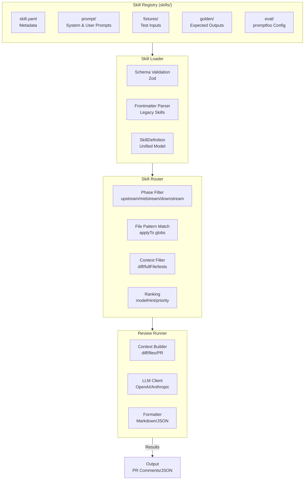

# River Reviewer Architecture

> **Note:** 公開版のアーキテクチャ解説は [`pages/explanation/river-architecture.md`](../pages/explanation/river-architecture.md) を参照してください。本ファイルは実装詳細の内部補足資料です。

## Overview

River Reviewer is a **Skill Registry-based AI code review framework** that transforms implicit team knowledge into reproducible, version-controlled agent skills.

The core philosophy: **"Skills are the main feature."** Everything else—GitHub Actions, CLI, Node API—are just interfaces to execute these skills.

## Architecture Principles

1. **Skills as First-Class Assets**
   - Each skill is a versioned, testable, documented artifact
   - Skills live in a registry with metadata, prompts, fixtures, and evaluations
   - Skills can be shared, improved, and composed

2. **Separation of Concerns**
   - **Skill Definition** (what to check) is separate from **Execution Environment** (how to run)
   - Skills are portable across different execution contexts (Actions, CLI, API)

3. **Data-Driven Routing**
   - Skills declare their requirements (phase, file patterns, input context)
   - The framework automatically routes files to appropriate skills

4. **Evaluation-Driven Development**
   - Every skill includes test fixtures and golden outputs
   - promptfoo integration enables regression testing and quality measurement

## Core Components

## References

- [Skill YAML Specification](../specs/skill-yaml-spec.md)
- [Skill Registry README](../skills/README.md)
- [Migration Guide](./migration/skill-migration-guide.md)
- [promptfoo Documentation](https://www.promptfoo.dev/)
