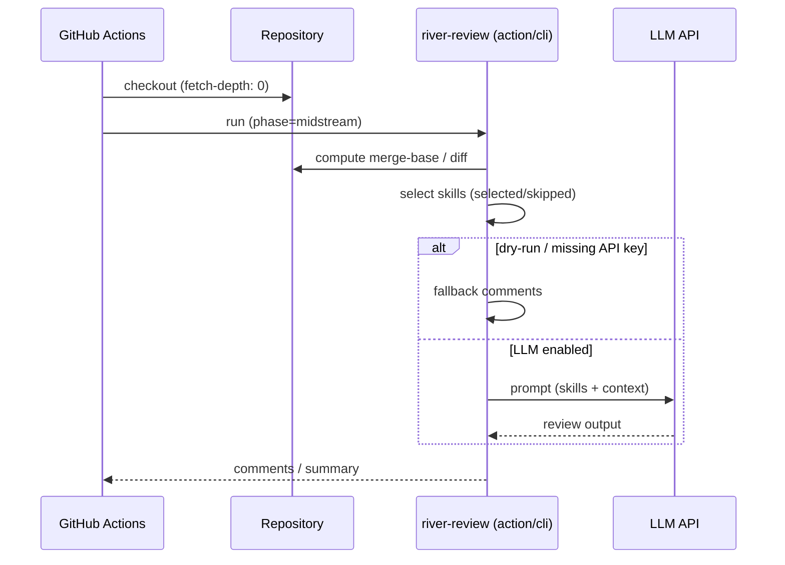
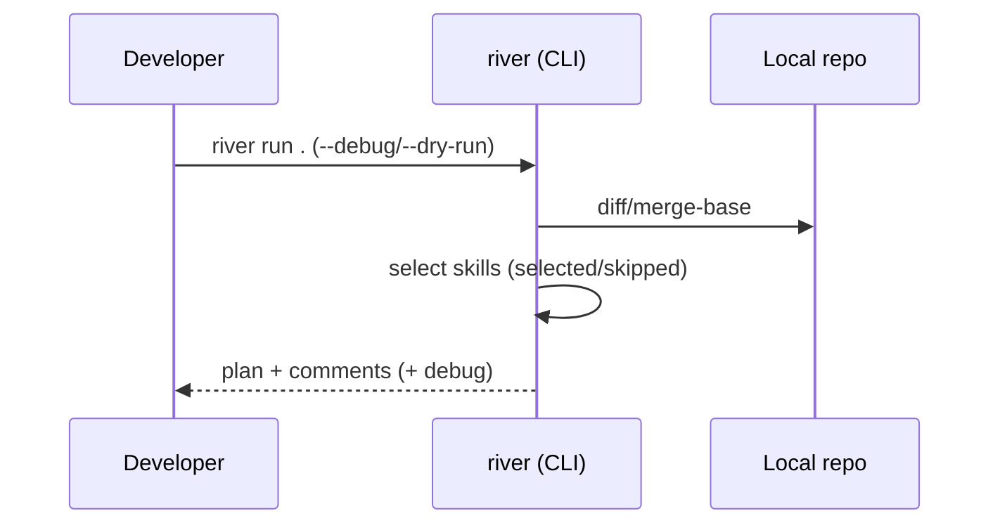

# The River Architecture

River Review flows with your development process.

Conceptually, the flow has three major segments (see [Upstream / Midstream / Downstream phases](./upstream-midstream-downstream.md)):

- **Upstream**: requirements, architecture, ADR, design
- **Midstream**: implementation, refactoring, CI integration
- **Downstream**: QA, test analysis, release checks

A fourth layer -- [**Riverbed Memory**](./riverbed-memory.md) -- stores contextual decisions so that subsequent reviews can reuse them.

River Review is a **context engineering framework**. It systematically selects, filters, and assembles context—skills, diffs, and memory—to maximize review quality within a bounded context window. Progressive disclosure ensures that only the necessary level of detail is loaded at each stage, preventing attention dilution.

## Components

```mermaid
flowchart LR
  Diff[Git diff / PR diff] --> Optimizer[Diff optimizer]
  Optimizer --> Loader[Skill loader]
  Loader --> Filter{phase/applyTo\ninputContext/dependencies}
  Filter -->|selected| Planner[Skill planner\n(optional)]
  Filter -->|skipped + reasons| Skipped[Skipped list]
  Planner --> Runner[Review runner]
  Runner --> Output[Output schema\nissues[] + summary]
```

## Representative flow (GitHub Actions)



## Representative flow (local)


