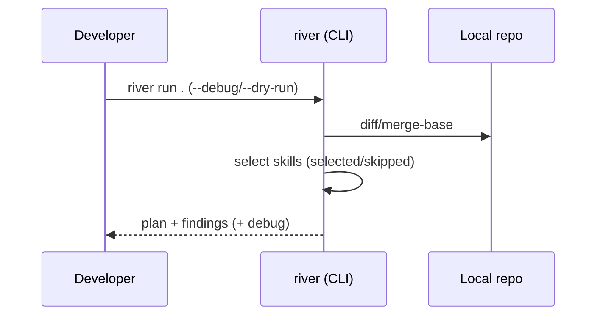

# The River Architecture

River Review flows with your development process.

Conceptually, the flow has three major segments (see [Upstream / Midstream / Downstream phases](./upstream-midstream-downstream.md)):

- **Upstream**: requirements, architecture, ADR, design
- **Midstream**: implementation, refactoring, CI integration
- **Downstream**: QA, test analysis, release checks

A fourth layer -- [**Riverbed Memory**](./riverbed-memory.md) -- stores contextual decisions so that subsequent reviews can reuse them.

River Review is a **context engineering framework**. It systematically selects, filters, and assembles context—skills, diffs, and memory—to maximize review quality within a bounded context window. Progressive disclosure ensures that only the necessary level of detail is loaded at each stage, preventing attention dilution.

## Components

```mermaid
flowchart LR
  Diff[Git diff / PR diff] --> Optimizer[Diff optimizer]
  Optimizer --> Loader[Skill loader]
  Loader --> Filter{phase/applyTo\ninputContext/dependencies}
  Filter -->|selected| Planner[Skill planner\n(optional)]
  Filter -->|skipped + reasons| Skipped[Skipped list]
  Planner --> Runner[Review runner]
  Runner --> Output[Output schema\nfindings[] + summary]
```

## Representative flow (GitHub Actions)


## Representative flow (local)



## CLI-first execution surface and resolution order

The **canonical execution surface of River Review is the CLI**. GitHub Action / Claude Code command / Codex skill / MCP / shell are designed as thin wrappers that call this CLI (e.g. the GitHub Action is a thin adapter: `runners/github-action/src/index.mjs` merely imports `src/cli.mjs`). Review judgement, skill resolution, and gate decisions live in the CLI, not in each surface.

- **Command name**: both `river` and `river-review` bins point to `src/cli.mjs`. In agent-facing docs and examples, prefer `river-review` to avoid ambiguity.
- **Subcommands**: `river-review run <path>` (local diff review), `river-review review plan|exec|verify` (artifact-driven gate), `river-review skills <subcommand>`.
- **JSON is the first-class output**: the Review Artifact conforming to `schemas/review-artifact.schema.json` (`version: "1"`) is the machine-readable contract. PR inline comments / Checks / Markdown summary / dashboard / agent handoff are adapters that transform this JSON (`--output markdown` is a human-facing derived view).

### skill / gate / config resolution order

Which skills / gates / rules are ultimately selected is resolved deterministically and can be inspected via `--debug` output (`plan.selectedSkills` / `skippedSkills` with reasons). Precedence (highest first):

1. **CLI explicit options** — `--skill-set` / `--context` / `--dependency`, etc. (the config file is auto-detected from the repo root, not via a `--config` flag; see below)
2. **Repository local** — `.river-review.{json,yaml,yml}` (`src/config/loader.mjs`), `.river/rules.md` + `.river/rules.d/*.md`, `skills/registry.yaml`
3. **Built-in** — bundled skills and defaults

> A user-global tier (`~/.river-review/`) is not implemented yet ([#1045](https://github.com/s977043/river-review/issues/1045) follow-up). When added, it slots between "Repository local" and "Built-in".

### No auto-update

The CLI / Action ship no auto-update mechanism. Consumers pin and update versions explicitly (GitHub Action version pinning, npm lockfiles). This is a deliberate choice favoring deterministic execution and auditability.

See also: gate responsibilities in [Review Gates Design](https://github.com/s977043/river-review/blob/main/docs/development/review-gates-design.md) (in-repo dev doc), and config options in [config-schema](../reference/config-schema.en.md).
