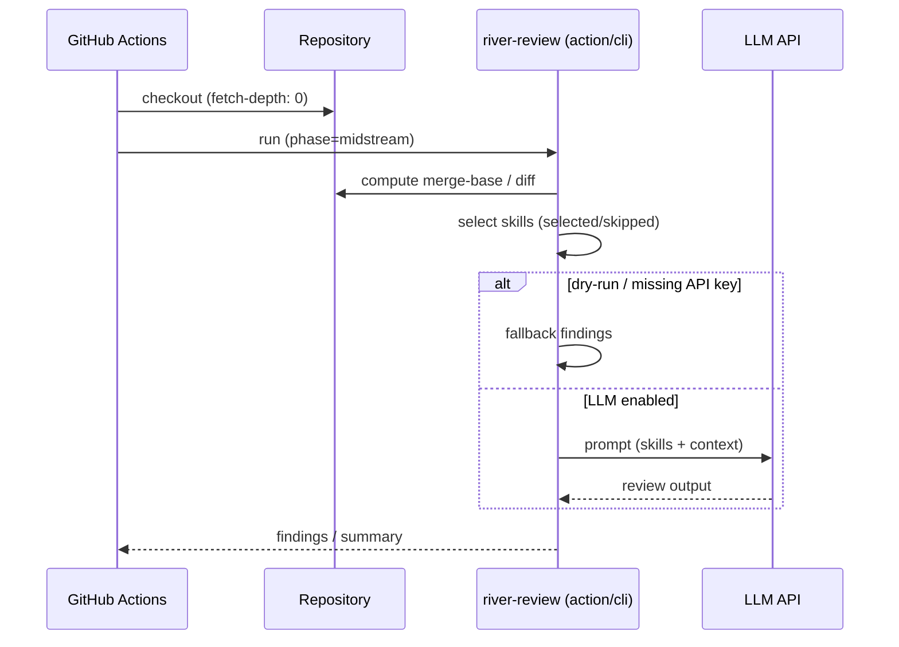
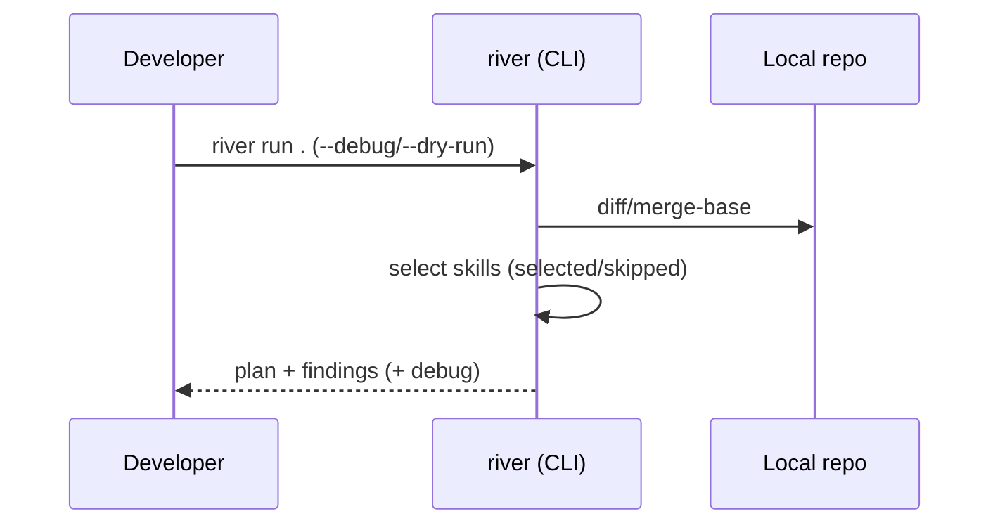

# River Review のアーキテクチャ

River Review は、変更の流れに沿って「上流 → 中流 → 下流」の観点でレビューを組み立てます（詳細は [上流・中流・下流フェーズ](./upstream-midstream-downstream.md) を参照）。

- **上流（upstream）**: 要件、設計、ADR、脅威モデル、制約
- **中流（midstream）**: 実装、リファクタ、CI 組み込み、品質
- **下流（downstream）**: テスト、リリース、運用、失敗パス検知

加えて、[**Riverbed Memory**](./riverbed-memory.md) は意思決定や前提（ルール）を保持し、レビューの一貫性を高めるための層です。

River Review は **context engineering framework** です。スキル・差分・メモリを体系的に選択・フィルタ・組み立てることで、限られたコンテキストウィンドウの中でレビュー品質を最大化します。スキルの段階的開示（Progressive Disclosure）により、必要なときに必要な詳細度だけをロードし、注意力の希薄化を防ぎます。

## コンポーネント

```mermaid
flowchart LR
  Diff[Git diff / PR diff] --> Optimizer[Diff optimizer]
  Optimizer --> Loader[Skill loader]
  Loader --> Filter{phase/applyTo\ninputContext/dependencies}
  Filter -->|selected| Planner[Skill planner\n(optional)]
  Filter -->|skipped + reasons| Skipped[Skipped list]
  Planner --> Runner[Review runner]
  Runner --> Output[Output schema\nfindings[] + summary]
```

## 代表フロー（GitHub Actions）



## 代表フロー（ローカル）



## CLI-first 実行面と解決順序

River Review の**正規実行面は CLI** です。GitHub Action / Claude Code command / Codex skill / MCP / shell は、原則としてこの CLI を呼ぶ薄い wrapper として設計します。たとえば GitHub Action は `runners/github-action/src/index.mjs` が `src/cli.mjs` を import するだけの thin adapter です。レビュー判断・skill 解決・gate 判定は CLI 側に集約し、各 surface には持たせません。

- **コマンド名**: bin は `river` と `river-review` の両方が `src/cli.mjs` を指す。agent 向けの説明・examples では、曖昧さを避けるため `river-review` を第一候補とする。
- **サブコマンド**: `river-review run <path>`（ローカル diff レビュー）、`river-review review plan|exec|verify`（artifact-driven gate）、`river-review skills <subcommand>`。
- **JSON が一次成果物**: `schemas/review-artifact.schema.json`（`version: "1"`）に準拠した Review Artifact が machine-readable 契約である。PR inline comment / Check / Markdown summary / dashboard / agent handoff は、この JSON を変換する adapter として扱う（`--output markdown` は人間向け派生表示）。

### skill / gate / config の解決順序

最終的にどの skill / gate / rule が採用されたかは決定論的に解決され、`--debug` 出力の `plan.selectedSkills` / `skippedSkills`（理由付き）で確認できます。優先順位は次のとおり（上が優先）:

1. **CLI 明示指定** — `--skill-set` / `--context` / `--dependency` など（設定ファイルは `--config` フラグではなくリポジトリ直下から自動検出する。下記参照）
2. **リポジトリローカル** — `.river-review.{json,yaml,yml}`（`src/config/loader.mjs`）、`.river/rules.md` + `.river/rules.d/*.md`、`skills/registry.yaml`
3. **ユーザーグローバル** — `~/.river-review/config.{json,yaml,yml}`（`src/config/loader.mjs`）。ユーザー全体のベース設定として常に適用される。リポジトリローカル設定がある場合は、グローバルをベースにリポジトリローカルが上書きマージされる（リポジトリローカルが優先）。共有 home を使う CI 等で意図しない設定混入を避けたい場合は、`RIVER_REVIEW_DISABLE_GLOBAL_CONFIG=1` でこの tier を無効化できる。
4. **ビルトイン** — 同梱 skill と既定値

### auto-update は導入しない

CLI / Action は自動アップデート機構を持ちません。バージョンは利用側が明示的に固定・更新します（GitHub Action のバージョンピン、npm の lockfile など）。これは決定論的な実行と監査可能性を優先する設計判断です。

関連: review gate の責務分担は [Review Gates Design](https://github.com/s977043/river-review/blob/main/docs/development/review-gates-design.md)（リポジトリ内 dev ドキュメント）、設定項目は [config-schema](../reference/config-schema.md) を参照。
