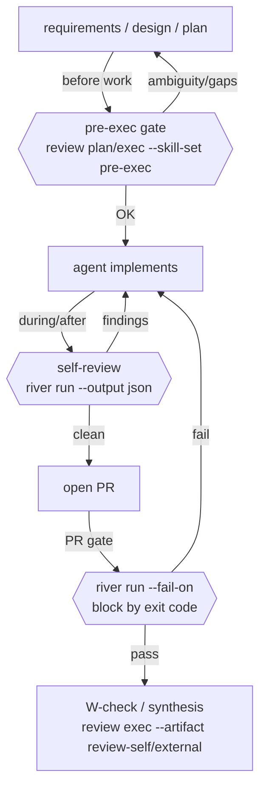

This page is a practical, case-by-case guide for **AI agents (autonomous / semi-autonomous coding agents)** on _when_ and _how_ to call River Review. In AI-driven development the agent writes and fixes the code, but the key is to **let River Review gate the work and read its (JSON) output to decide the next action mechanically**.

> For the minimal per-tool invocation (Claude Code / Cursor / Codex / Copilot), see [Use River Review from an AI agent](./agent-workflow.en.md). This page covers **case-by-case usage along the AI-driven development loop**.

## The agent's stance (5 principles)

1. **Don't review yourself. Let River Review gate.** Instead of the agent's own judgement, have the deterministically-routed skills review, and act on the result.
2. **Read JSON, not human-facing text.** Use `--output json` and consume `river run`'s `issues[]` / `summary.issueCountBySeverity` and `river review`'s `findings[]` as structured data. `--output markdown` is for humans (PR comments) — the human-readable summary appears there; the machine-readable `decision` is also included in JSON output.
3. **Branch on exit code and severity.** With `--fail-on <severity>`, finding severity becomes the exit code (1=fail / 2=warn / 0=pass) on both `river run` and `river review`. The agent branches on the exit code, or on `summary.issueCountBySeverity` counts: proceed / fix / escalate to a human.
4. **Trust deterministic routing.** Which skills were selected/skipped (with reasons) is visible in `--debug` (`selectedSkills` / `skippedSkills`). Selection is decided by phase, target paths, and input context, and reproduces every time.
5. **Understand the execution model (usually no LLM key is needed).** When you (the agent) load the skills / sub-agent and **review with your own model, no River Review LLM key is needed**. The `river run` / `river review` commands on this page are the **headless path**, where the agent calls River Review as an external tool — only then is an LLM key (`ANTHROPIC_API_KEY` / `OPENAI_API_KEY` / `GOOGLE_API_KEY`) required (the 12 mechanical-check viewpoints still run without one, and `--offline` runs rules-only explicitly). See [What is River Review § Execution model](../explanation/what-is-river-review.en.md).

## Where River Review sits in the AI-driven development loop



River Review only **emits findings and a verdict**; the final GO/NO-GO decision is made by whoever calls the gate (the agent or PlanGate).

## Case by stage (primary axis)

### Case 1: Before work — requirements / design / plan review (pre-exec gate)

**Before** implementation, eliminate requirement ambiguity, missing validation in the design, and plan inconsistencies.

```bash
# Execute (produces findings / needs an LLM key). pre-exec skills are
# upstream-phase, so --phase upstream is required.
river review exec --skill-set pre-exec --phase upstream \
  --artifact pbi-input=pbi-input.md \
  --artifact plan=plan.md \
  --artifact adr=docs/adr/001.md \
  --output json

# Without a key, just preview which skills would run (the plan)
river review plan --skill-set pre-exec --phase upstream --plan-only \
  --artifacts-dir ./planning
```

- **Input**: `pbi-input` (requirements) / `plan` / `todo` / `test-cases` / `adr` (design).
- **Output**: a Review Artifact (`findings[]` + `plan` + `debug`). Read each finding's `severity` / `message` / `suggestion`.
- **Agent's next action**: fold the `findings` and any open points in `message` back into the plan, then start implementing. If there is a `critical`, **do not start implementing**.
- **Note**: the `--artifact` files (`pbi-input.md`, etc.) must already exist; an unresolvable path exits 3.

### Case 2: During / right after implementation — self-review and self-fix loop

Right after the agent writes code, review its own diff and self-fix from the findings.

```bash
river run . --base main --output json
```

- **Output**: `{ issues[], summary, decision }` (`output.schema.json`). Read `issues[].severity` (critical/major/minor/info) and `message` / `file` / `line`.
- **Stop condition**: use `decision` (`auto-approve` / `human-review-recommended` / `human-review-required`) together with `summary.issueCountBySeverity` for machine-readable gate logic. `decision === 'auto-approve'` with zero blocking (critical/major) findings is a safe auto-continue signal.
- **Agent's next action (self-fix loop)**: fix `issues` by severity → re-run `river run` → repeat until `issues` is empty or info-only.
- For large tasks use `--depth thorough`; to narrow scope use `--files <glob>`. `--base` auto-detects the default branch when omitted, so on repos whose default is not `main` (`master`/`develop`), omit it or pass `--base <default>`.

### Case 3: PR submission gate — block mechanically via exit code

Before opening a PR, gate the CI / agent pipeline by a severity threshold.

```bash
river run . --base main --fail-on critical --warn-on major --output markdown \
  --output-file ./review.md
```

- **exit code**: `0`=pass / `1`=fail (≥ `--fail-on`) / `2`=warn. **The agent branches on the exit code** (fail → back to fixing, pass → continue the PR).
- Post the `--output markdown` result as a PR comment (for human reviewers). Use exit code for machine decisions, markdown for human presentation.
- `--advisory-only` reports findings but always exits 0 (observation mode).

### Case 4: Verification — W-check (re-audit a review result)

Have River Review **re-audit** another AI's / a human's review result to detect omissions, false positives, hallucinations, and missing evidence (double review).

```bash
river review exec --artifact review-self=./self-review.md \
  --artifact review-external=./external-review.md \
  --artifact diff=./diff.patch --output json
```

- The Independent Review Synthesis skill dedups and verifies, emitting a unified verdict. See [W-check](./w-check.en.md) / [Use Independent Review Synthesis](./use-independent-review-synthesis.en.md).
- Useful in multi-agent development to fold each agent's review into one.
- Note: the dedicated `river review verify` subcommand has a defined contract but execution is not implemented yet (currently exit 3). Use the `review exec` path above for W-checks.

### Case 5: Multi-agent / parallel roles

Start multiple reviewer roles in parallel in a single `river run`.

```bash
river run . --reviewers bug-hunter,security-scanner,test-gap --output json
# or auto-decide roles from the diff content
river run . --reviewers auto --output json
```

- Get role-divided perspectives at once; results are returned deduped. See [agent-workflow](./agent-workflow.en.md) for how `--reviewers auto` works.

## Task type × skill-set matrix (secondary axis)

Within each stage, pick `--skill-set` by task type (sets: `adversarial` / `basic` / `comprehensive` / `multitenancy` / `pre-exec` / `review-quality` / `typescript`).

| Task type                   | Main stage            | Recommended `--skill-set`                        | Notes                        |
| --------------------------- | --------------------- | ------------------------------------------------ | ---------------------------- |
| requirements/design/plan    | before work (Case 1)  | `pre-exec` (`--phase upstream`)                  | pre-implementation gate      |
| feature work                | after impl / PR (2,3) | `comprehensive`                                  | broad coverage               |
| bug fix                     | after impl (Case 2)   | `basic`                                          | light & fast                 |
| refactor                    | after impl (Case 2)   | `review-quality`                                 | design quality / readability |
| security-sensitive          | impl / PR (2,3)       | `comprehensive` + `--reviewers security-scanner` | multi-perspective            |
| multi-tenant SaaS           | before work / impl    | `multitenancy`                                   | tenant isolation             |
| TypeScript-centric          | after impl (Case 2)   | `typescript`                                     | type / null safety           |
| critical / high-risk change | before PR (Case 3)    | `adversarial`                                    | pre-mortem / war-game        |

> When no set is given, skills are **auto-selected** by phase, target paths, and input context. Start with no flag (auto) and reach for `--skill-set` only when you want to narrow the lens.
>
> ⚠️ **phase trap**: `comprehensive` / `multitenancy` / `adversarial` bundle upstream skills (e.g. `rr-upstream-multitenancy-isolation-001` / `rr-upstream-pre-mortem-001`). Running them with `river run` under the default midstream **silently skips** those on a phase mismatch. To also apply the upstream lens, run a separate `--phase upstream`, or always check `--debug`'s `skippedSkills` for what actually ran.

## Agent operations helpers

Features that keep an autonomous loop safe and efficient.

- **Suppress false positives (avoid infinite loops)**: when a finding cannot be fixed or is an accepted risk, record it with `river suppression add --fingerprint <fp> --feedback <false_positive|accepted_risk> --rationale "..."`. Without this the agent re-flags the same finding every iteration and the self-fix loop never converges.
- **Convergence signal (run persistence)**: use `--save` to store under `.river/runs/`, then `river runs diff <id> <id>` or `river run . --baseline <prev json>` to compare new-vs-fixed. Judge convergence by **whether findings are decreasing**, not by `loop_count` alone.
- **Cost ceiling (runaway guard)**: for deep reviews or large diffs use `--max-cost <usd>` (abort if the estimate is exceeded) and `--estimate` (estimate only) to cap runaway LLM spend.

## Agent implementation pattern (pseudocode)

```text
# pre-work gate
plan_result = run("river review exec --skill-set pre-exec --phase upstream --artifact ... --output json")
if any(f.severity == "critical" for f in plan_result.findings):
    resolve(plan_result.questions, plan_result.findings)   # fix the plan, re-run
    goto pre-work gate

implement()   # the agent implements

# self-fix loop
loop:
    result = run("river run . --base main --fail-on critical --output json")
    if result.exit_code == 0: break          # pass
    fix(result.issues)                       # fix findings
    if loop_count > N: escalate_to_human(result.summary)   # escalate if it does not converge

# Render the PR comment from the JSON already obtained (re-running river run
# would duplicate the LLM call, so avoid it).
open_pr(to_markdown(result.issues))
```

Key points: **consume JSON structurally and branch on exit code / severity (`summary.issueCountBySeverity`)**; do not parse text. Escalate to a human if it does not converge (River Review only supplies decision material; avoid infinite self-fixing).

## Anti-patterns

- ❌ **Regex-parsing human-facing text** → use `--output json` (`issues` / `findings`).
- ❌ **Applying every River Review finding unconditionally** → triage by `severity`. Route `info` / `minor` to follow-ups and make only `critical` a blocking condition ([review policy](../reference/review-policy.en.md); whether `major` also auto-gates depends on calibration).
- ❌ **Expecting real findings with no key** → without a key it is heuristic / empty. Set a key in CI.
- ❌ **Expecting `review verify` to execute** → it is a stub (exit 3). Use `review exec --artifact review-self/external` for W-checks.
- ❌ **Calling pre-exec without `--phase upstream`** → upstream skills are phase-mismatched and all skipped.

## Output contract quick reference

| Command                  | JSON schema                           | Main keys                                                                           |
| ------------------------ | ------------------------------------- | ----------------------------------------------------------------------------------- |
| `river run`              | `schemas/output.schema.json`          | `issues[]`, `summary.issueCountBySeverity`, `summary.issueCountByPhase`, `decision` |
| `river review plan/exec` | `schemas/review-artifact.schema.json` | `version`, `status`, `phase`, `findings[]`, `plan`, `debug`                         |

> The `decision` field in `river run --output json` (`auto-approve` / `human-review-recommended` / `human-review-required`) is derived deterministically from findings. It is omitted when scoring fails, so check for its presence before reading it. Make machine decisions from the **exit code (`--fail-on`)**, **`summary.issueCountBySeverity`**, and **`decision`** in combination. For `river review plan/exec`, the verdict is available as the `decision` field in the Review Artifact.

## Related pages

- [Use River Review from an AI agent](./agent-workflow.en.md) (per-tool invocation)
- [Choosing and combining skills](./choose-skills.en.md) / [Debugging skill routing](./debug-skill-routing.en.md)
- [Two-stage review gate (pre-PR + post-PR)](./two-stage-review-gate.en.md)
- [W-check (double review)](./w-check.en.md) / [Use Independent Review Synthesis](./use-independent-review-synthesis.en.md)
- [Review scope and where to use it](../explanation/review-scope.en.md) / [River Review architecture](../explanation/river-architecture.en.md)
