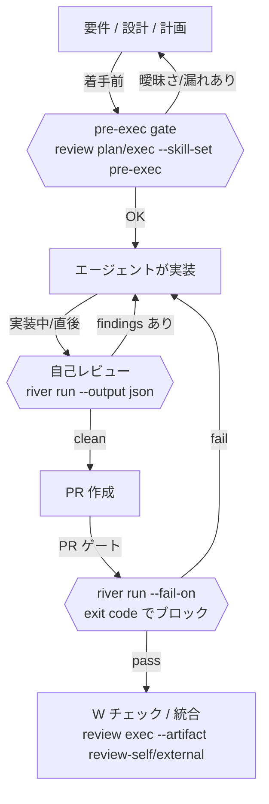

このページは **AI エージェント（自律 / 半自律のコーディングエージェント）** が River Review を「いつ・どう呼ぶか」をケース別にまとめた実践ガイドです。AI 駆動開発では、コードを書いて直すのはエージェントですが、**レビューは River Review にゲートさせ、出力（JSON）を読んで次の行動を機械的に決める**のが要点です。

> ツール別（Claude Code / Cursor / Codex / Copilot）の最小呼び出しは [AI エージェントから River Review を使う](./agent-workflow.md) を参照。本ページは **AI 駆動開発のループに沿ったケース別の使い分け**を扱います。

## エージェントの基本姿勢（5 原則）

1. **自分でレビューしない。River Review にゲートさせる。** エージェントの自己判断ではなく、決定論的にルーティングされた skill にレビューさせ、結果を根拠に行動する。
2. **JSON を読む（人間向け text は読まない）。** `--output json` を使い、`river run` は `issues[]` / `summary.issueCountBySeverity`、`river review` は `findings[]` を構造化データとして消費する。`--output markdown` は人間（PR コメント）向けで、verdict 等の要約はこちらに出る（JSON には含まれない）。
3. **exit code と重大度で分岐する。** `--fail-on <severity>` を付けると finding の重大度が exit code（1=fail / 2=warn / 0=pass）になる（`river run` / `river review` 両対応）。エージェントは exit code、または `summary.issueCountBySeverity` の件数で「次へ進む / 修正する / 人間にエスカレーション」を機械判断する。
4. **決定論ルーティングを信頼する。** どの skill が選ばれ／除外されたかは `--debug` の `selectedSkills` / `skippedSkills`（理由付き）で確認できる。フェーズ・対象パス・入力コンテキストで決まり、毎回再現する。
5. **実行モデルを理解する（通常 LLM キーは不要）。** あなた（エージェント）がスキル / サブエージェントを読み込み**自分のモデルでレビューするなら、River Review 用の LLM キーは不要**。本ページの `river run` / `river review` コマンドは、エージェントが River Review を**外部ツールとして呼ぶヘッドレス経路**である。その場合だけ LLM キー（`ANTHROPIC_API_KEY` 等）が要る（機械的チェックの 12 観点はキー無しでも動き、`--offline` で明示的に rules-only 実行もできる）。詳細は [River Review とは § 実行モデル](../explanation/what-is-river-review.md)。

## AI 駆動開発ループにおける River Review の位置



River Review は**指摘（findings）と verdict を出す**だけで、進行可否（GO/NO-GO）の最終決定はゲートを呼ぶ側（エージェント or PlanGate）が行います。

## ステージ別ケース（主軸）

### Case 1: 着手前 — 要件 / 設計 / 計画レビュー（pre-exec gate）

実装を始める**前**に、要件の曖昧さ・設計の検証漏れ・計画の不整合を潰します。

```bash
# 実行（findings を得る / 要 LLM キー）。pre-exec の skill は upstream フェーズなので --phase upstream が必須。
river review exec --skill-set pre-exec --phase upstream \
  --artifact pbi-input=pbi-input.md \
  --artifact plan=plan.md \
  --artifact adr=docs/adr/001.md \
  --output json

# キー無しで「どの skill が実行されるか」だけ確認（プラン）
river review plan --skill-set pre-exec --phase upstream --plan-only \
  --artifacts-dir ./planning
```

- **入力**: `pbi-input`（要件）/ `plan`（実装計画）/ `todo` / `test-cases` / `adr`（設計）。
- **出力**: Review Artifact（`findings[]` + `plan` + `debug`）。各 finding の `severity` / `message` / `suggestion`（修正提案）を読む。
- **エージェントの次行動**: `findings` の指摘と `message` の不明点を計画に反映してから実装着手。critical があれば**実装に入らない**。
- **注**: `--artifact` に渡すファイル（`pbi-input.md` 等）は事前に存在している必要がある。パスが解決できないと exit 3。

### Case 2: 実装中 / 直後 — 差分の自己レビューと自己修正ループ

エージェントがコードを書いた直後に自分の差分をレビューし、指摘を読んで自己修正します。

```bash
river run . --base main --output json
```

- **出力**: `{ issues[], summary }`（`output.schema.json`）。`issues[].severity`（critical/major/minor/info）と `message` / `file` / `line` を読む。
- **エージェントの次行動（自己修正ループ）**: `issues` を重大度順に修正 → 再度 `river run` → `issues` が空 or info のみになるまで反復。
- タスクが大きい場合は `--depth thorough`、対象を絞るなら `--files <glob>`。`--base` は省略時に default ブランチを自動検出するため、`main` 以外（`master`/`develop` 等）のリポジトリでは省略するか `--base <default>` を明示する。

### Case 3: PR 提出ゲート — exit code で機械的にブロック

PR を出す前に、重大度しきい値で CI / エージェントのパイプラインをゲートします。

```bash
river run . --base main --fail-on critical --warn-on major --output markdown \
  --output-file ./review.md
```

- **exit code**: `0`=pass / `1`=fail（`--fail-on` 以上）/ `2`=warn。**エージェントは exit code で分岐**（fail なら修正へ戻る、pass なら PR 続行）。
- `--output markdown` の結果を PR コメントへ投稿（人間レビュアー向け）。機械判断は exit code、人間提示は markdown、と使い分ける。
- `--advisory-only` を付けると指摘は出すが常に exit 0（観測モード）。

### Case 4: 検証 — W チェック（レビュー結果の再点検）

別の AI / 人間のレビュー結果を **River Review に再点検**させ、漏れ・誤検知・ハルシネーション・根拠欠落を検出します（二重レビュー）。

```bash
river review exec --artifact review-self=./self-review.md \
  --artifact review-external=./external-review.md \
  --artifact diff=./diff.patch --output json
```

- Independent Review Synthesis skill が重複排除・検証を行い、統合 verdict を出す。詳細は [W チェック](./w-check.md) / [Independent Review Synthesis を使う](./use-independent-review-synthesis.md)。
- マルチエージェント開発で、各エージェントのレビューを 1 つへ束ねる用途に有効。
- 注: 専用の `river review verify` サブコマンドは契約のみ定義済みで実行は未実装（現状 exit 3）。W チェックは上記 `review exec` 経路を使う。

### Case 5: マルチエージェント / 並列ロール

1 回の `river run` で複数のレビュアーロールを並列起動します。

```bash
river run . --reviewers bug-hunter,security-scanner,test-gap --output json
# あるいは diff 内容からロールを自動決定
river run . --reviewers auto --output json
```

- 役割分担した複数視点を一括で得て、結果は dedup 済みで返る。仕組みは [agent-workflow](./agent-workflow.md) を参照。

## タスク種別 × skill-set マトリクス（副軸）

各ステージ内で、タスク種別に応じて `--skill-set` を選びます（セット一覧: `adversarial` / `basic` / `comprehensive` / `multitenancy` / `pre-exec` / `review-quality` / `typescript`）。

| タスク種別          | 主に使うステージ         | 推奨 `--skill-set`                               | 補足                               |
| ------------------- | ------------------------ | ------------------------------------------------ | ---------------------------------- |
| 要件 / 設計 / 計画  | 着手前 (Case 1)          | `pre-exec`（`--phase upstream`）                 | 実装前ゲート                       |
| 機能追加            | 実装直後 / PR (Case 2,3) | `comprehensive`                                  | 横断的に網羅                       |
| バグ修正            | 実装直後 (Case 2)        | `basic`                                          | 軽量・高速                         |
| リファクタ          | 実装直後 (Case 2)        | `review-quality`                                 | 設計品質・可読性重視               |
| セキュリティ重視    | 実装 / PR (Case 2,3)     | `comprehensive` + `--reviewers security-scanner` | 多視点                             |
| マルチテナント SaaS | 着手前 / 実装            | `multitenancy`                                   | テナント分離観点                   |
| TypeScript 中心     | 実装直後 (Case 2)        | `typescript`                                     | 型安全・null 安全                  |
| 重要 / 高リスク変更 | PR 前 (Case 3)           | `adversarial`                                    | pre-mortem / war-game で前提を崩す |

> セットを指定しない場合は、フェーズ・対象パス・入力コンテキストから**自動選択**されます。迷ったら無指定（自動）で始め、観点を絞りたいときだけ `--skill-set` を使うのが基本。
>
> ⚠️ **phase trap**: `comprehensive` / `multitenancy` / `adversarial` は upstream skill（例 `rr-upstream-multitenancy-isolation-001` / `rr-upstream-pre-mortem-001`）を含む。既定の midstream で `river run` するとそれらは**フェーズ不一致で無警告 skip**される。upstream 観点も効かせたいなら別途 `--phase upstream` で実行するか、`--debug` の `skippedSkills` で実際に走った skill を必ず確認すること。

## エージェント運用の補助機能

自律ループを安全・効率的に回すための機能。

- **誤検知の抑制（無限ループ回避）**: 同じ指摘を直せない／受容する場合は `river suppression add --fingerprint <fp> --feedback <false_positive|accepted_risk> --rationale "..."` で記録する。これをしないとエージェントが同じ finding を毎回拾い、自己修正ループが収束しない。
- **収束の判定（run 永続化）**: `--save` で `.river/runs/` に保存し、`river runs diff <id> <id>` や `river run . --baseline <前回 json>` で「新規 / 解消」を比較する。`loop_count` だけに頼らず、**指摘が減っているか**で収束を判断する。
- **コスト上限（暴走防止）**: 深いレビューや大きな diff では `--max-cost <usd>`（見積り超過で中断）と `--estimate`（見積りのみ）でランナウェイ LLM コストを防ぐ。

## エージェント実装パターン（擬似コード）

```text
# 着手前ゲート
plan_result = run("river review exec --skill-set pre-exec --phase upstream --artifact ... --output json")
if any(f.severity == "critical" for f in plan_result.findings):
    resolve(plan_result.questions, plan_result.findings)   # 計画を直してから再実行
    goto 着手前ゲート

implement()   # エージェントが実装

# 自己修正ループ
loop:
    result = run("river run . --base main --fail-on critical --output json")
    if result.exit_code == 0: break          # pass
    fix(result.issues)                       # 指摘を修正
    if loop_count > N: escalate_to_human(result.summary)   # 収束しなければ人間へ

# PR コメントは取得済み JSON から描画する（river run を再実行すると LLM 呼び出しが二重化するため避ける）
open_pr(to_markdown(result.issues))
```

要点: **出力は JSON を構造化消費し、分岐は exit code / 重大度（`summary.issueCountBySeverity`）で行う**。text をパースしない。収束しない場合は人間にエスカレーションする（River Review は判断材料を出すだけで、無限自己修正は避ける）。

## アンチパターン

- ❌ **人間向け text 出力を正規表現でパースする** → `--output json`（`issues` / `findings`）を使う。
- ❌ **River Review の指摘を無条件に全部適用する** → `severity` で取捨。`info` / `minor` はフォローアップに回し、`critical` のみブロック条件にする運用が安定（[レビューポリシー](../reference/review-policy.md)参照。`major` も自動ゲートに含めるかは calibration 次第）。
- ❌ **キー未設定で実 findings を期待する** → キーが無いと heuristic / 空。CI ではキーを設定する。
- ❌ **`review verify` で実行を期待する** → 現状 stub（exit 3）。W チェックは `review exec --artifact review-self/external`。
- ❌ **pre-exec を `--phase upstream` 無しで呼ぶ** → upstream skill がフェーズ不一致となり全 skip される。

## 出力契約クイックリファレンス

| コマンド                 | JSON スキーマ                         | 主なキー                                                                |
| ------------------------ | ------------------------------------- | ----------------------------------------------------------------------- |
| `river run`              | `schemas/output.schema.json`          | `issues[]`, `summary.issueCountBySeverity`, `summary.issueCountByPhase` |
| `river review plan/exec` | `schemas/review-artifact.schema.json` | `version`, `status`, `phase`, `findings[]`, `plan`, `debug`             |

> **verdict は JSON に含まれない**。`auto-approve` / `human-review-recommended` / `human-review-required` の verdict は `--output markdown` の人間向け要約にのみ現れる（`output.schema.json` の `summary` は件数のみ、Review Artifact の `debug` は自由形式で verdict を保証しない）。エージェントの機械判断は **exit code（`--fail-on`）** と **`summary.issueCountBySeverity`** で行うこと（verdict が必要なら markdown を別途取得）。

## 関連ページ

- [AI エージェントから River Review を使う](./agent-workflow.md)（ツール別の呼び出し方）
- [スキルの選択と組み合わせ](./choose-skills.md) / [スキルルーティングのデバッグ](./debug-skill-routing.md)
- [2 段構えレビューゲート（PR 前 + PR 後）](./two-stage-review-gate.md)
- [W チェック（二重レビュー）](./w-check.md) / [Independent Review Synthesis を使う](./use-independent-review-synthesis.md)
- [レビュー対象と使いどころ](../explanation/review-scope.md) / [River Review のアーキテクチャ](../explanation/river-architecture.md)
